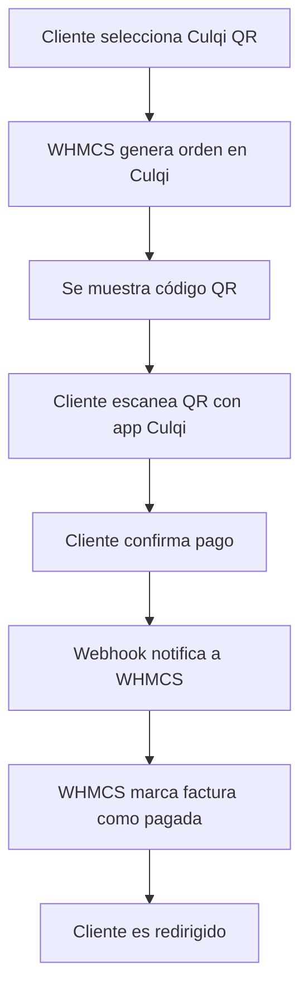

# Culqi QR - Módulo de Pago para WHMCS

<div align="center">


**Módulo de gateway de pago con códigos QR de Culqi para WHMCS**

</div>

---

## 📋 Descripción

Este módulo permite a tus clientes pagar sus facturas en WHMCS escaneando un código QR con la aplicación móvil de Culqi. Es una forma rápida, segura y conveniente de procesar pagos en Perú.

## ✨ Características

- ✅ **Generación automática de QR**: Crea códigos QR únicos para cada factura
- ✅ **Verificación en tiempo real**: Monitorea el estado del pago automáticamente
- ✅ **Múltiples monedas**: Soporte para PEN y USD
- ✅ **Webhooks**: Notificaciones instantáneas de cambios de estado
- ✅ **Reembolsos**: Procesa reembolsos directamente desde WHMCS
- ✅ **Modo sandbox**: Ambiente de pruebas para desarrollo
- ✅ **Auto-redirección**: Redirige automáticamente después del pago exitoso
- ✅ **Expiración configurable**: Define el tiempo de vida de cada QR
- ✅ **Logs detallados**: Registro completo de transacciones para debugging
- ✅ **Responsive**: Interfaz optimizada para móviles y desktop

## 📦 Requisitos

- WHMCS 8.0 o superior
- PHP 7.4 o superior
- Extensión cURL de PHP habilitada
- Cuenta de Culqi (sandbox o producción)
- API Keys de Culqi

## 🚀 Instalación

### Opción 1: Instalación Manual

1. **Descargar los archivos del módulo**

2. **Subir archivos a tu instalación de WHMCS**
   ```bash
   # Copiar el archivo principal del gateway
   /path/to/whmcs/modules/gateways/culqiqr.php

   # Copiar el archivo de callback
   /path/to/whmcs/modules/gateways/callback/culqiqr.php
   ```

3. **Configurar permisos**
   ```bash
   chmod 644 /path/to/whmcs/modules/gateways/culqiqr.php
   chmod 644 /path/to/whmcs/modules/gateways/callback/culqiqr.php
   ```

### Opción 2: Instalación vía FTP

1. Conecta a tu servidor vía FTP
2. Navega a la carpeta de tu instalación de WHMCS
3. Sube `culqiqr.php` a `modules/gateways/`
4. Sube `culqiqr.php` (callback) a `modules/gateways/callback/`

## ⚙️ Configuración

### 1. Activar el módulo en WHMCS

1. Inicia sesión en el panel de administración de WHMCS
2. Ve a **Setup** > **Payments** > **Payment Gateways**
3. Busca "Culqi QR" en la lista de gateways
4. Haz clic en el módulo para activarlo

### 2. Configurar credenciales de Culqi

Completa los siguientes campos:

| Campo | Descripción |
|-------|-------------|
| **Ambiente** | Selecciona `Sandbox` para pruebas o `Producción` para pagos reales |
| **Public Key** | Tu llave pública de Culqi (pk_test_xxx o pk_live_xxx) |
| **Secret Key** | Tu llave secreta de Culqi (sk_test_xxx o sk_live_xxx) |
| **Moneda** | Moneda para los pagos (PEN o USD) |
| **Tiempo de expiración** | Tiempo en minutos antes de que expire el QR (por defecto: 15) |
| **Auto-redirección** | Redirigir automáticamente después del pago (Sí/No) |
| **Modo de prueba** | Activar logs detallados para debugging (Sí/No) |

### 3. Obtener tus API Keys de Culqi

#### Para Sandbox (Pruebas):
1. Visita [https://panel.culqi.com](https://panel.culqi.com)
2. Inicia sesión con tu cuenta
3. Ve a **Desarrollo** > **API Keys**
4. Copia tu `Public Key` y `Secret Key` de **Sandbox**

#### Para Producción:
1. En el panel de Culqi, ve a **Desarrollo** > **API Keys**
2. Copia tu `Public Key` y `Secret Key` de **Producción**
3. Asegúrate de que tu cuenta esté verificada y aprobada

### 4. Configurar Webhooks (Recomendado)

Los webhooks permiten que Culqi notifique a WHMCS instantáneamente cuando cambia el estado de un pago.

1. En el panel de Culqi, ve a **Desarrollo** > **Webhooks**
2. Haz clic en "Crear Webhook"
3. Configura la URL del webhook:
   ```
   https://tudominio.com/modules/gateways/callback/culqiqr.php
   ```
4. Selecciona los siguientes eventos:
   - `order.status.changed`
   - `charge.succeeded`
   - `charge.failed`
5. Guarda el webhook

## 🎯 Uso

### Para Administradores

1. Una vez configurado, el método de pago "Culqi QR" aparecerá automáticamente en el checkout
2. Los clientes podrán seleccionarlo como método de pago
3. Puedes ver el estado de las transacciones en **Utilities** > **Logs** > **Gateway Log**

### Para Clientes

1. El cliente selecciona "Pago con QR (Culqi)" en el checkout
2. Se genera automáticamente un código QR único
3. El cliente abre su app de Culqi
4. Escanea el código QR mostrado
5. Confirma el pago en la app
6. El sistema verifica automáticamente el pago y actualiza la factura
7. El cliente es redirigido a la página de confirmación

## 🔄 Flujo de Pago



## 💰 Reembolsos

El módulo soporta reembolsos directamente desde WHMCS:

1. Ve a **Billing** > **Transactions**
2. Encuentra la transacción a reembolsar
3. Haz clic en "Refund Transaction"
4. Ingresa el monto a reembolsar
5. El módulo procesará el reembolso automáticamente en Culqi

## 🔍 Solución de Problemas

### El QR no se genera

**Posibles causas:**
- API Keys incorrectas
- Ambiente mal configurado (sandbox vs producción)
- Problema de conectividad con la API de Culqi

**Solución:**
1. Verifica tus API Keys
2. Activa el "Modo de prueba" para ver logs detallados
3. Revisa el Gateway Log en WHMCS

### El pago no se registra automáticamente

**Posibles causas:**
- Webhooks no configurados correctamente
- URL del webhook incorrecta
- Firewall bloqueando las peticiones de Culqi

**Solución:**
1. Verifica la configuración de webhooks en Culqi
2. Asegúrate de que la URL sea accesible públicamente
3. Revisa los logs del webhook en el panel de Culqi

### Error "Module Not Activated"

**Causa:** El módulo no está activado en WHMCS

**Solución:**
1. Ve a Setup > Payments > Payment Gateways
2. Activa el módulo "Culqi QR"
3. Guarda la configuración

## 📊 Base de Datos

El módulo crea automáticamente una tabla para rastrear transacciones:

```sql
CREATE TABLE `mod_culqiqr_transactions` (
    `id` int(10) NOT NULL AUTO_INCREMENT,
    `invoice_id` int(10) NOT NULL,
    `transaction_id` varchar(255) NOT NULL,
    `order_id` varchar(255) NOT NULL,
    `status` varchar(50) NOT NULL,
    `created_at` datetime NOT NULL,
    `updated_at` datetime NOT NULL,
    PRIMARY KEY (`id`),
    KEY `invoice_id` (`invoice_id`),
    KEY `transaction_id` (`transaction_id`),
    KEY `order_id` (`order_id`)
) ENGINE=InnoDB DEFAULT CHARSET=utf8;
```

## 🔐 Seguridad

- ✅ Todas las comunicaciones con Culqi usan HTTPS
- ✅ Las API Keys se almacenan de forma segura en la base de datos
- ✅ Los webhooks pueden validarse con firma HMAC
- ✅ Protección contra ataques de duplicación de pagos
- ✅ Validación de montos y estados

## 🧪 Testing

### Modo Sandbox

1. Configura el ambiente como "Sandbox"
2. Usa tus API Keys de sandbox
3. Genera facturas de prueba
4. Usa la app de Culqi en modo sandbox para pagar

### Datos de prueba de Culqi

Consulta la [documentación de Culqi](https://docs.culqi.com/) para datos de prueba actualizados.

## 📝 Logs

### Activar logs detallados

1. En la configuración del módulo, activa "Modo de prueba"
2. Los logs se guardarán en **Utilities** > **Logs** > **Gateway Log**

### Tipos de logs

- `create_order_error`: Error al crear orden
- `Webhook Received`: Webhook recibido de Culqi
- `Payment Success`: Pago exitoso
- `Payment Failed`: Pago fallido
- `Charge Success`: Cargo exitoso
- `Charge Failed`: Cargo fallido

## 🎨 Personalización

### Personalizar el HTML del QR

Puedes modificar el HTML generado en la función `culqiqr_link()` en el archivo `culqiqr.php`.

### Personalizar estilos CSS

Los estilos CSS están incluidos inline en el módulo. Puedes modificarlos según tus necesidades o moverlos a un archivo CSS externo.

## 🔄 Actualizaciones

Para actualizar el módulo:

1. Descarga la nueva versión
2. Reemplaza los archivos existentes
3. Limpia el caché de WHMCS
4. Verifica que todo funcione correctamente

## 📚 Recursos

- [Documentación de Culqi API](https://docs.culqi.com/)
- [Documentación de WHMCS Gateway Modules](https://developers.whmcs.com/payment-gateways/)
- [Panel de Culqi](https://panel.culqi.com)
- [Soporte de WHMCS](https://www.whmcs.com/support/)

## 🤝 Soporte

Si encuentras problemas o tienes preguntas:

1. Revisa la sección de [Solución de Problemas](#-solución-de-problemas)
2. Consulta los logs del módulo
3. Abre un issue en [GitHub](https://github.com/iBlack14/plugin-qulqui-qr/issues)

## 📄 Licencia

MIT © [iBlack14](https://github.com/iBlack14)

## 🙏 Créditos

- Desarrollado por [iBlack14](https://github.com/iBlack14)
- API de pagos por [Culqi](https://culqi.com)
- Sistema de facturación por [WHMCS](https://www.whmcs.com)

---

<div align="center">

**¿Te resultó útil este módulo? ⭐ Dale una estrella en [GitHub](https://github.com/iBlack14/plugin-qulqui-qr)**

</div>
